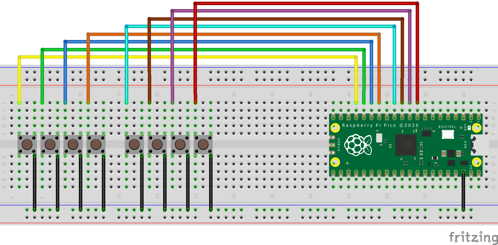
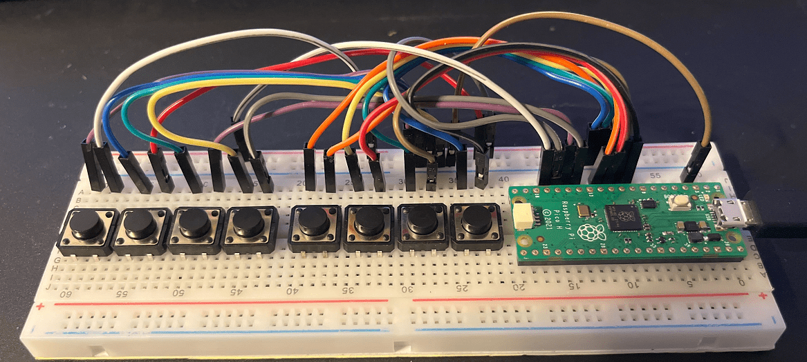
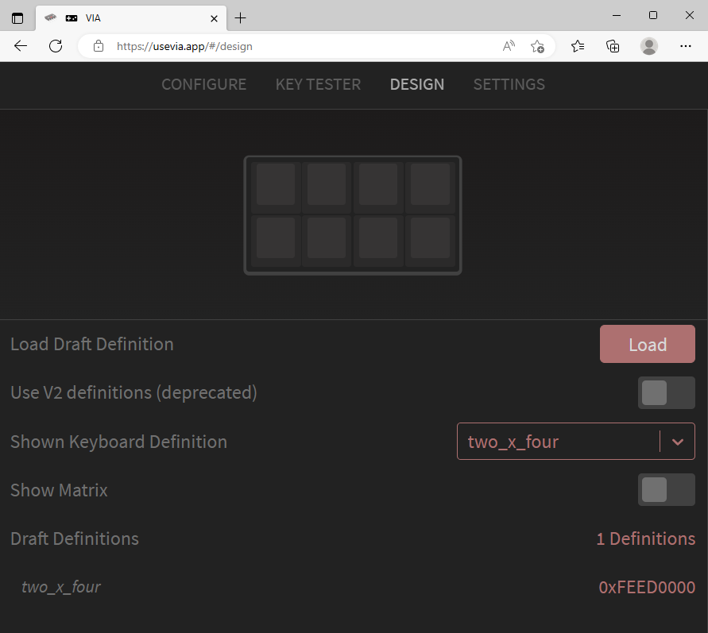

# Information about Pico-QMK-VIA Prototype

## Hardware

* Parts
  * Raspberry Pico[^1]
  * Eight tactile switches[^2]
  * Breadboard, Wires

* Schematic


* Breadboard


## Software

### Compile on Raspberry Pi

Any linux based operation system should work. If flashing does not work the generated uf2-file can be installed manually.
I used a Raspberry Pi Zero. Compilation takes about 3 min.

#### Setting up

* install rasbian lite and enable ssh
* install qmk[^3]

```
$ sudo apt install -y git python3-pip
$ python3 -mpip install --user qmk
$ qmk --version
1.1.1
$ qmk setup
Ψ QMK is ready to go, but minor problems were found
```
* remark: instead of getting "QMK is ready to go" i get "QMK is ready to go, but minor problems were found" at the end of the qmk setup

* check if generating uf2-file and manual installation onto pico works

```
$ cd ~/qmk_firmware
$ echo "checking if uf2-file is generated"
checking if uf2-file is generated
$ qmk clean
QMK Firmware 0.19.5
Deleting .build/ ... done.
$ qmk compile -kb handwired/onekey/rp2040 -km default
Ψ Compiling keymap with gmake --jobs=1 handwired/onekey/rp2040:default
...
Creating UF2 file for deployment: .build/handwired_onekey_rp2040_default.uf2                        [OK]
Copying handwired_onekey_rp2040_default.uf2 to qmk_firmware folder                                  [OK]
(Firmware size check does not yet support RP2040; skipping)
```

#### Compiling Firmware

* generate ortho_2x4 keyboard template

```
$ qmk new-keyboard
Ψ Generating a new QMK keyboard directory

Name Your Keyboard Project
For more infomation, see:
https://docs.qmk.fm/#/hardware_keyboard_guidelines?id=naming-your-keyboardproject

Keyboard Name? ortho_2x4

Attribution
Used for maintainer, copyright, etc

Your GitHub Username? xxx

More Attribution
Used for maintainer, copyright, etc

Your Real Name?  [xxx]

Pick Base Layout
As a starting point, one of the common layouts can be used to bootstrap the process

Default Layout?
        1. 60_abnt2
        2. 60_ansi
...
        51. tkl_nofrow_iso
        52. none of the above
Please enter your choice:  [52] 52

What Powers Your Project
For more infomation, see:
https://docs.qmk.fm/#/compatible_microcontrollers

MCU?
        1. bit_c_pro
        2. blackpill_f401
...
        31. MK66FX1M0
        32. MKL26Z64
        33. RP2040
        34. STM32F042
...
        52. WB32FQ95
Please enter your choice:  [25] 33
Ψ Created a new keyboard called ortho_2x4.
Ψ To start working on things, `cd` into keyboards/ortho_2x4,
Ψ or open the directory in your preferred text editor.
Ψ And build with qmk compile -kb ortho_2x4 -km default.
```

* the following files have been generated with in directory '~/qmk_firmware/keyboards/ortho_2x4'

```
keyboards/ortho_2x4/config.h
keyboards/ortho_2x4/info.json
keyboards/ortho_2x4/keymaps/default/keymap.c
keyboards/ortho_2x4/readme.md
keyboards/ortho_2x4/rules.mk
```

* adjust pin names in file "info.json"

```
 $ git diff keyboards/ortho_2x4/info.json
diff --git a/keyboards/ortho_2x4/info.json b/keyboards/ortho_2x4/info.json
index e512bbedd7..29a3e7167f 100644
--- a/keyboards/ortho_2x4/info.json
+++ b/keyboards/ortho_2x4/info.json
@@ -13,8 +13,8 @@
         "nkro": true
     },
     "matrix_pins": {
-        "cols": ["C2", "C2", "C2", "C2"],
-        "rows": ["D1", "D1", "D1", "D1"]
+        "cols": ["GP1", "GP2", "GP3", "GP4"],
+        "rows": ["GP5", "GP6", "GP7", "GP8"]
     },
     "processor": "RP2040",
     "url": "",
@@ -45,4 +45,4 @@
             ]
```

* compile ortho_2x4 firmware

```
$ qmk compile -kb ortho_2x4 -km default
Ψ Compiling keymap with gmake --jobs=1 ortho_2x4:default
...
Creating UF2 file for deployment: .build/ortho_2x4_default.uf2                                      [OK]
Copying ortho_2x4_default.uf2 to qmk_firmware folder                                                [OK]
(Firmware size check does not yet support RP2040; skipping)
```

* add line "#define FORCE_NKRO" in file config.h and line "VIA_ENABLE = yes" in file rules.mk
* verify that firmware still compiles

* change diode direction, matrix layout and keycodes in files "info.json" and "keymaps/default/keymap.c"

```
$ git diff keyboards/ortho_2x4/info.json
diff --git a/keyboards/ortho_2x4/info.json b/keyboards/ortho_2x4/info.json
index 29a3e7167f..3bb7f038dd 100644
--- a/keyboards/ortho_2x4/info.json
+++ b/keyboards/ortho_2x4/info.json
@@ -3,7 +3,6 @@
     "keyboard_name": "ortho_2x4",
     "maintainer": "xxx",
     "bootloader": "rp2040",
-    "diode_direction": "COL2ROW",
     "features": {
         "bootmagic": true,
         "command": false,
@@ -13,8 +12,10 @@
         "nkro": true
     },
     "matrix_pins": {
-        "cols": ["GP1", "GP2", "GP3", "GP4"],
-        "rows": ["GP5", "GP6", "GP7", "GP8"]
+        "direct": [
+            ["GP13", "GP12", "GP11", "GP10"],
+            ["GP9", "GP8", "GP7", "GP6"]
+       ]
     },
     "processor": "RP2040",
     "url": "",
@@ -24,7 +25,7 @@
         "vid": "0xFEED"
     },
     "layouts": {
-        "LAYOUT_ortho_4x4": {
+        "LAYOUT_ortho_2x4": {
             "layout": [
                 { "matrix": [0, 0], "x": 0, "y": 0 },
                 { "matrix": [0, 1], "x": 1, "y": 0 },
@@ -33,15 +34,7 @@
                 { "matrix": [1, 0], "x": 0, "y": 1 },
                 { "matrix": [1, 1], "x": 1, "y": 1 },
                 { "matrix": [1, 2], "x": 2, "y": 1 },
-                { "matrix": [1, 3], "x": 3, "y": 1 },
-                { "matrix": [2, 0], "x": 0, "y": 2 },
-                { "matrix": [2, 1], "x": 1, "y": 2 },
-                { "matrix": [2, 2], "x": 2, "y": 2 },
-                { "matrix": [2, 3], "x": 3, "y": 2 },
-                { "matrix": [3, 0], "x": 0, "y": 3 },
-                { "matrix": [3, 1], "x": 1, "y": 3 },
-                { "matrix": [3, 2], "x": 2, "y": 3 },
-                { "matrix": [3, 3], "x": 3, "y": 3 }
+                { "matrix": [1, 3], "x": 3, "y": 1 }
             ]
         }
     }
$ git diff keyboards/ortho_2x4/keymaps/default/keymap.c
diff --git a/keyboards/ortho_2x4/keymaps/default/keymap.c b/keyboards/ortho_2x4/keymaps/default/keymap.c
index 26769e0bee..5dc5fb7e24 100644
--- a/keyboards/ortho_2x4/keymaps/default/keymap.c
+++ b/keyboards/ortho_2x4/keymaps/default/keymap.c
@@ -12,10 +12,8 @@ const uint16_t PROGMEM keymaps[][MATRIX_ROWS][MATRIX_COLS] = {
      * │ 0 │ . │Ent│ + │
      * └───┴───┴───┴───┘
      */
-    [0] = LAYOUT_ortho_4x4(
-        KC_P7,   KC_P8,   KC_P9,   KC_PSLS,
-        KC_P4,   KC_P5,   KC_P6,   KC_PAST,
-        KC_P1,   KC_P2,   KC_P3,   KC_PMNS,
-        KC_P0,   KC_PDOT, KC_PENT, KC_PPLS
+    [0] = LAYOUT_ortho_2x4(
+        KC_P1,   KC_P2,   KC_P3,   KC_P4,
+        KC_P5,   KC_P6,   KC_P7,   KC_P8
     )
 };
$ cat keyboards/ortho_2x4/info.json
{
    "manufacturer": "xxx",
    "keyboard_name": "ortho_2x4",
    "maintainer": "xxx",
    "bootloader": "rp2040",
    "features": {
        "bootmagic": true,
        "command": false,
        "console": false,
        "extrakey": true,
        "mousekey": true,
        "nkro": true
    },
    "matrix_pins": {
        "direct": [
            ["GP13", "GP12", "GP11", "GP10"],
            ["GP9", "GP8", "GP7", "GP6"]
        ]
    },
    "processor": "RP2040",
    "url": "",
    "usb": {
        "device_version": "1.0.0",
        "pid": "0x0000",
        "vid": "0xFEED"
    },
    "layouts": {
        "LAYOUT_ortho_2x4": {
            "layout": [
                { "matrix": [0, 0], "x": 0, "y": 0 },
                { "matrix": [0, 1], "x": 1, "y": 0 },
                { "matrix": [0, 2], "x": 2, "y": 0 },
                { "matrix": [0, 3], "x": 3, "y": 0 },
                { "matrix": [1, 0], "x": 0, "y": 1 },
                { "matrix": [1, 1], "x": 1, "y": 1 },
                { "matrix": [1, 2], "x": 2, "y": 1 },
                { "matrix": [1, 3], "x": 3, "y": 1 }
            ]
        }
    }
}
$ git cat keyboards/ortho_2x4/keymaps/default/keymap.c
git: 'cat' is not a git command. See 'git --help'.

The most similar commands are
        clean
        mktag
        stage
        stash
        tag
        var
$ cat keyboards/ortho_2x4/keymaps/default/keymap.c
#include QMK_KEYBOARD_H

const uint16_t PROGMEM keymaps[][MATRIX_ROWS][MATRIX_COLS] = {
    /*
     * ┌───┬───┬───┬───┐
     * │ 1 │ 2 │ 3 │ 4 │
     * ├───┼───┼───┼───┤
     * │ 5 │ 6 │ 7 │ 8 │
     * └───┴───┴───┴───┘
     */
    [0] = LAYOUT_ortho_2x4(
        KC_P1,   KC_P2,   KC_P3,   KC_P4,
        KC_P5,   KC_P6,   KC_P7,   KC_P8
    )
};
```

* verify that firmware still compiles
* if keyboard hardware is available, flash keyboard and verify that key mapping is correct[^4

## Usage

* create a file named "ortho_via.json" with the following content:

´´´
{
  "name": "ortho_2x4" ,
  "vendorId": "0xFEED",
  "productId": "0x0000",
  "matrix": { "rows": 2, "cols": 4 },
  "layouts": 
  {
    "keymap": 
	 [
		[{"y":0,"x":0},"0,0",{"x":1},"0,1",{"x":2},"0,2",{"x":3},"0,3"],
		[{"y":1,"x":0},"1,0",{"x":1},"1,1",{"x":2},"1,2",{"x":3},"1,3"]
	 ]
  }
}
´´´

* verify that key mapping can be changed using via[^5]
* the ui interface should look similiar to the following:




[^1]: [Raspberry Pico](https://www.raspberrypi.com/products/raspberry-pi-pico/)
[^2]: [Adafruit Tactile Switch Buttons](https://www.adafruit.com/product/1119
[^3]: [Adafruit Learning System: Using QMK on RP2040] (https://learn.adafruit.com/using-qmk-on-rp2040-microcontrollers/overview)
[^4]: If you have a WebHID enabled browser like Chrome or Edge use [VIA](https://usevia.app/#/) otherwise use [key-rollover-test](https://www.mechanical-keyboard.org/key-rollover-test/)
[^5]: File is available at: [via_ortho_2x4.json](firmware/via_ortho_2x4.json)
[^6]:[VIA](https://www.caniusevia.com)

tasks:
a) reproduce adafuit one key qmk example
b) compile firmware on raspberry zero
c) add via support
d) add 4x2 keys

add a)
https://learn.adafruit.com/using-qmk-on-rp2040-microcontrollers/rp2040-one-key-keyboard
worked, but not with avaible uf2-file (https://cdn-learn.adafruit.com/assets/assets/000/113/316/original/handwired_onekey_rp2040_default.uf2?1658260686)
had to generate uf2 file using "handwired/onekey/rp2040" via https://config.qmk.fm/#/handwired/onekey/rp2040/LAYOUT_ortho_1x1
compiling (baking) via online service takes about 3 min
to flash firmware on raspberry pico as usually press reset button while
connecting to pc and copy uf2 file to RPI-RP2 drive
after one-key "a" worked changed "a" to "mute" via online gui and keymap.json

add b)
- install rasbian on raspberry zero e.g. raspberry pi os lite (debian version 11)
- activate ssh and optionally change hostname and user credentials
- the rasberry zero has to be connected to the network, e.g. using an
  usb-ethernet adapter for around 7 EUR
- install qmk using:
sudo apt install -y git python3-pip
python3 -mpip install --user qmk
qmk --version
qmk setup
- remark and the end of the setup there appears no the message "QMK is ready
  to go" the message that appears is "QMK is ready ato go, but minor problems
were found". Automatic flashing does not work I have to manually copy the uf2
file, which is OK for me.  
- cd ~/qmk_firmware
- qmk clean
- qmk compile -kb handwired/onekey/rp2040 -km default
-> a file "handwired_onekey_rp2040_default.uf2" has been generated after >= 5 min
-> flash the file onto pico and verify that pressing the button reasults in an "a" 
# inserting pico into usb-ethernet hub resets ethernet connection
# lsusb
# Bus 001 Device 004: ID 2e8a:0003 Raspberry Pi RP2 Boot
# $ git diff
# diff --git a/keyboards/handwired/onekey/keymaps/default/keymap.c
# b/keyboards/handwired/onekey/keymaps/default/keymap.c
# index a5782f7a13..64c832d131 100644
# --- a/keyboards/handwired/onekey/keymaps/default/keymap.c
# +++ b/keyboards/handwired/onekey/keymaps/default/keymap.c
# @@ -1,5 +1,7 @@
#  #include QMK_KEYBOARD_H
# 
#  const uint16_t PROGMEM keymaps[][MATRIX_ROWS][MATRIX_COLS] = {
# -    LAYOUT_ortho_1x1(KC_A)
# +//    LAYOUT_ortho_1x1(KC_A)
# +//    LAYOUT_ortho_1x1(KC_MUTE)
# +    LAYOUT_ortho_1x1(KC_CAPS)
#  };
# qmk import-keymap ~/handwired_onekey_rp2040_layout_ortho_1x1_KC_MS_U.json

add d)
- use adding a new keyboard section
qmk new-keyboard
-2by4
-change keys to GPx in file info.json
-change layout in info.json and keymapping in keymap.c
-nkro did not work since also bootmagic was enabled in info.json, and #define FORCE_NKRC was missing in config.h (perhaps defined in config.h is sufficient)


all changes as executed:
>

misc:
https://www.reddit.com/r/askscience/comments/vxs7bb/how_does_pressing_the_calculator_button_on_my/


different links:
http://builder.swillkb.com/
https://www.youtube.com/watch?v=UKfeJrRIcxw
https://media.ccc.de/v/froscon2021-2644-mechanische_tastaturen
ergogen

https://media.ccc.de/v/froscon2021-2644-mechanische_tastaturen

<!--
compress files e.g. https://www.iloveimg.com
-->
